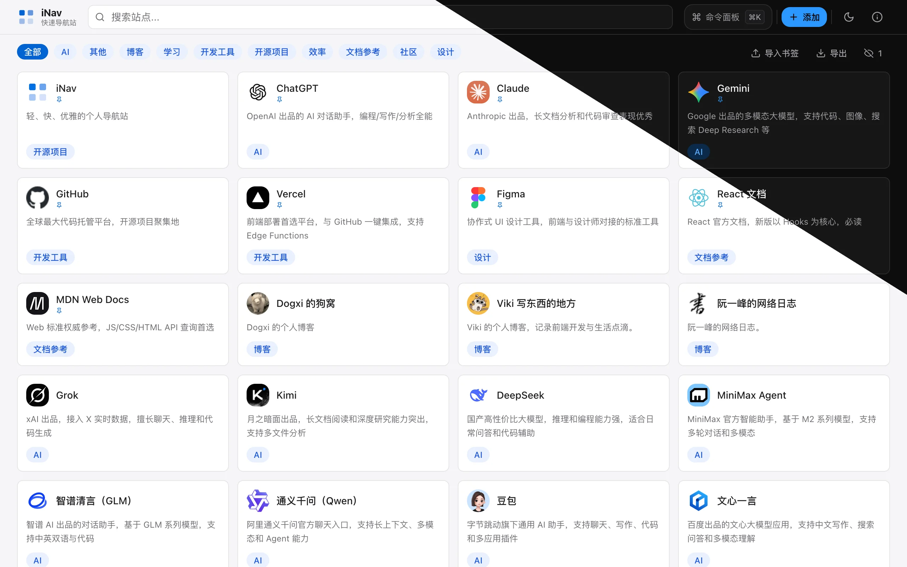
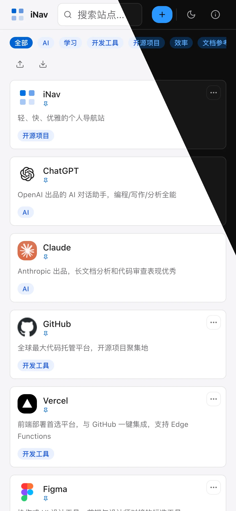
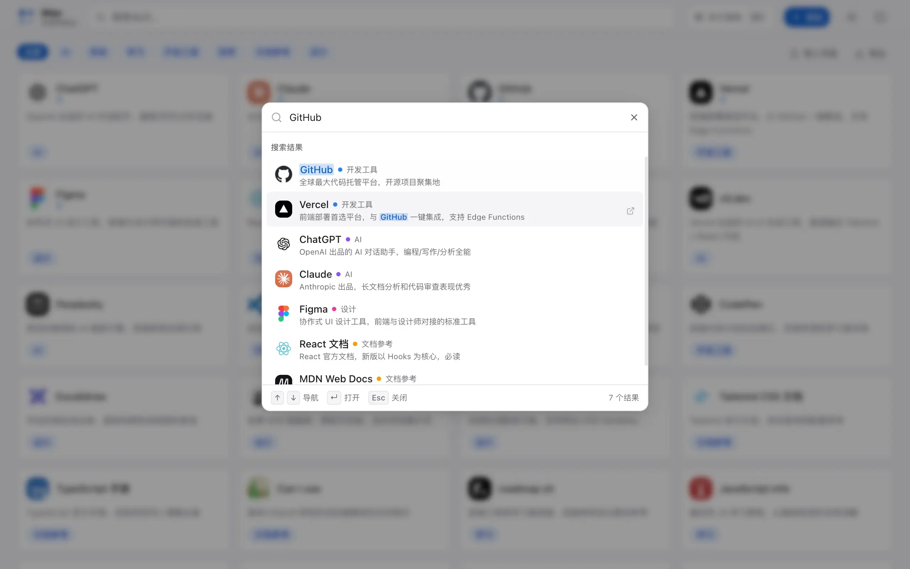
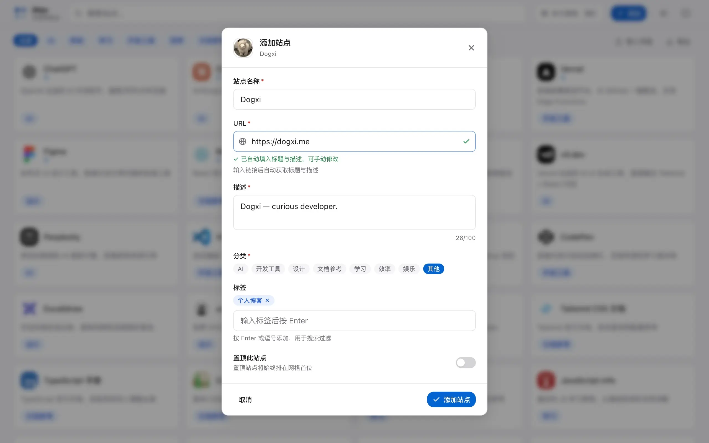

<div align="center">


# iNavX

个人导航站：公共目录由后台管理，个人收藏保存在浏览器。

React 19 · TypeScript · Vite · Go · SQLite

[快速开始](#快速开始) · [项目结构](docs/project-structure.md) · [后台指南](docs/admin-guide.md) · [部署与恢复](docs/deployment.md) · [代码规范](docs/code-quality.md)

</div>

## 功能

- 搜索名称、描述、标签与 URL，按分类和多个标签筛选；结果同时包含所有已选标签，可继续叠加关键词。支持配置搜索引擎。
- `Ctrl/Cmd+K` 打开命令面板，方向键选择、Enter 执行、Esc 关闭。操作使用英文 ID 和中文说明，例如 `>add`、`>theme`、`>copy github`、`>hide github`；搜索覆盖完整目录，每批展示 30 条。
- 添加个人收藏、导入浏览器书签、导出 JSON/HTML、备份个人偏好及隐藏记录。
- 单管理员后台维护站点、分类颜色、搜索引擎、回收站与匿名收录申请。
- 配置品牌图标、站点介绍、公告、分享信息和页脚；图片支持上传、地址和图片库，远程图片及元数据辅助服务默认关闭。
- 后台修改检查目录版本，冲突时保留草稿；公共页面在跨页通知、重新联网或切回页面时刷新。
- 完整 ZIP 备份包含 SQLite 与上传图片；JSON 迁移包用于内容迁移，访客个人备份独立保存。

## 快速开始

完整功能使用 Go 后端与 SQLite，推荐 Docker Compose 部署。Vercel 等静态托管仅支持纯静态前台，不提供后台和服务器备份。

### Docker Compose

```bash
cp .env.example .env
# 编辑 .env，将 APP_ORIGIN 设置为实际访问来源
docker compose up -d --build
docker compose exec app inav setup-token
```

打开 `/admin`，使用初始化凭据创建管理员。数据与备份保存在独立卷，升级前按[部署说明](docs/deployment.md)备份并保留回退版本。

### 本地开发

需要 Bun 1.3.12、Go 1.27.1 和 C 编译器。测试另需 Node 22.18+；完整检查的工具安装见[代码规范](docs/code-quality.md#格式与检查)。Windows 可使用 MinGW-w64，也可使用 WSL 或 Docker。

```bash
git clone https://github.com/anosu/iNavX.git
cd iNavX
bun install --frozen-lockfile
cp .env.example .env
# 编辑 .env：APP_ORIGIN=http://localhost:5173
bun run dev:server
```

另一个终端运行 `bun dev`，打开 `http://localhost:5173`。运行 `bun run dev:server setup-token` 获取初始化凭据；Bun 命令加载同一份 `.env`，CLI 与服务必须使用相同数据目录。

```bash
bun run format       # 格式化
bun run check        # Lint、类型与单元/交互测试
bunx playwright install chromium
bun run check:full   # 再加构建、浏览器回归及部署演练
```

生产构建运行 `bun run build && bun run build:server && bun start`。`bun run preview` 只预览前端文件。

### 数据从哪里来

| 内容 | 管理位置 | 保存位置 |
| --- | --- | --- |
| 公共站点、分类、设置与申请 | `/admin` | `DATA_DIR/inav.sqlite` |
| 上传图片 | 后台图片库 | `DATA_DIR/media/` |
| 个人收藏、隐藏与偏好 | 首页 | 当前浏览器 localStorage |
| 新实例种子、纯静态目录 | `seed/sites.json` 与 `shared/defaults.ts` | 仓库，构建或首次初始化时读取 |

全栈前端不包含示例目录，空的公共目录不会被示例内容回填。修改种子不影响已有数据库。接口失败时可使用上次成功读取的缓存，并显示重试提示。

纯静态部署执行 `VITE_STATIC_MODE=true bun run build`；功能开关位于 `src/config/features.ts`，内容与元数据修改后需重新构建。详见[静态模式](docs/deployment.md#公共前台分离与静态模式)。

## 文档

| 文档 | 用途 |
| --- | --- |
| [项目结构](docs/project-structure.md) | 目录职责、数据边界、文件归属与 Git 忽略规则 |
| [后台指南](docs/admin-guide.md) | 管理、图片、申请审核及备份操作 |
| [部署与恢复](docs/deployment.md) | 开发环境、配置、部署、备份、升级与回滚 |
| [代码规范](docs/code-quality.md) | 模块边界、格式化、Lint、测试与发布检查 |

站内 `/about` 提供访客操作说明。实例运维记录和本地计划不进入 Git；开发与检查规则不依赖这些本地文件。

## 预览

以下保留原项目界面截图作为参考，当前配置与界面可能不同。



<details>
<summary>更多截图</summary>

| 移动端 | 命令面板 | 添加站点 |
| --- | --- | --- |
|  |  |  |

[历史静态版本 Lighthouse 截图](docs/assets/lighthouse.webp)不代表当前全栈版本的性能测量。

</details>

## License

MIT © [dogxii](https://github.com/dogxii)，见 [LICENSE](LICENSE)。问题与建议请提交 [Issue](https://github.com/anosu/iNavX/issues)。
